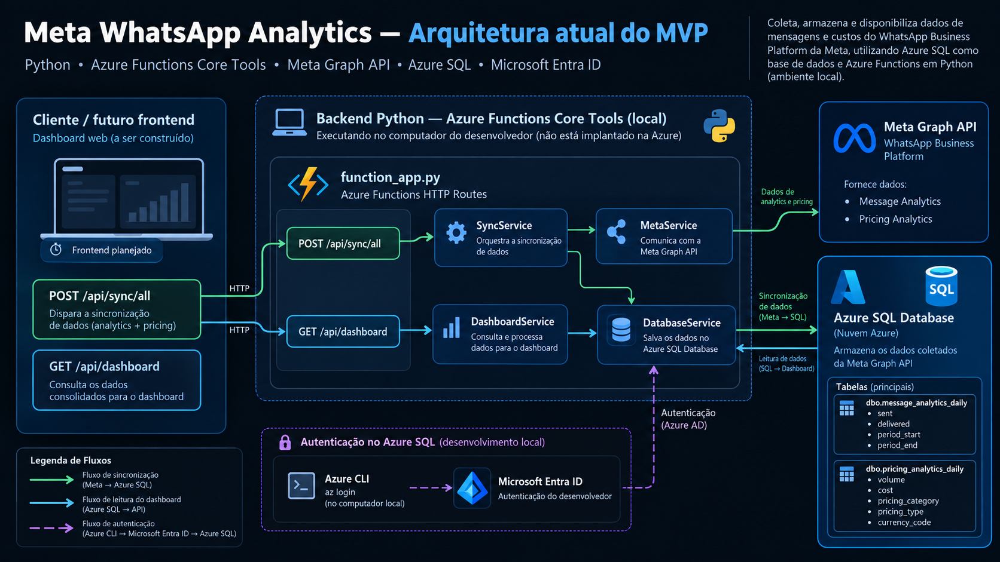

# Meta WhatsApp Analytics on Azure

MVP para coleta, persistência e exposição de métricas da **WhatsApp Business Platform (Meta)** usando **Python, Azure Functions e Azure SQL Database**.

O objetivo deste projeto é transformar dados brutos da Meta em uma camada de analytics própria, persistida em banco e pronta para ser consumida por um dashboard.

> **Status atual:** backend funcional localmente com Azure Functions Core Tools, integração real com a Meta Graph API, persistência em Azure SQL e endpoint consolidado de dashboard. O frontend visual ainda será construído.

---

## Visão geral

Hoje o sistema trabalha com dois conjuntos principais de dados:

1. **Message Analytics**
   - mensagens enviadas;
   - mensagens entregues;
   - período;
   - número;
   - país.

2. **Pricing Analytics**
   - volume;
   - custo;
   - moeda;
   - categoria de precificação;
   - tipo de precificação;
   - número;
   - país.

O MVP **não envia mensagens** e **não cria templates**. Ele é focado em coleta e análise.

---

## Arquitetura atual

<p align="center">
  
</p>

Existem dois fluxos distintos.

### Sincronização

```text
POST /api/sync/all
        ↓
SyncService
        ↓
MetaService
        ↓
Meta Graph API
        ↓
DatabaseService
        ↓
Azure SQL
```

A sincronização busca os dados atuais da Meta e persiste no banco.

### Leitura do dashboard

```text
GET /api/dashboard
        ↓
DashboardService
        ↓
DatabaseService
        ↓
Azure SQL
```

O dashboard **não depende da Meta para abrir**. Ele lê os dados já persistidos no Azure SQL.

Essa separação permite que a aplicação continue exibindo histórico mesmo que a API da Meta esteja temporariamente indisponível.

---

## Stack

| Tecnologia | Finalidade |
|---|---|
| Python 3.14 | Backend |
| Azure Functions Python v2 | API HTTP / runtime serverless |
| Azure Functions Core Tools 4 | Execução local |
| Meta Graph API v25.0 | Fonte dos dados do WhatsApp |
| Azure SQL Database | Persistência |
| `mssql-python` | Driver Python para Azure SQL |
| Microsoft Entra ID | Autenticação no banco |
| Azure CLI | Credencial local para Microsoft Entra |
| `requests` | Chamadas HTTP para a Meta |

O projeto utiliza o **modelo Python v2 do Azure Functions**, baseado em decorators no `function_app.py`.

Documentação:
- Azure Functions Python: https://learn.microsoft.com/azure/azure-functions/functions-reference-python
- `mssql-python`: https://learn.microsoft.com/sql/connect/python/mssql-python/connection-strings
- Meta WhatsApp Business Platform: https://www.postman.com/meta/whatsapp-business-platform/overview

---

## Estrutura do projeto

```text
meta-whatsapp-analytics/
│
├── function_app.py
├── host.json
├── local.settings.json
├── requirements.txt
│
├── services/
│   ├── __init__.py
│   ├── meta_service.py
│   ├── database_service.py
│   ├── dashboard_service.py
│   └── sync_service.py
│
└── .venv/
```

### `function_app.py`

Responsável pelas rotas HTTP.

Ele não deve concentrar regras de negócio nem SQL.

### `MetaService`

Responsável por toda comunicação com a Meta Graph API.

Exemplos:

```text
get_analytics()
get_pricing()
get_account_info()
```

### `DatabaseService`

Responsável pela comunicação com o Azure SQL.

Exemplos:

```text
get_connection()
test_connection()
upsert_message_analytics()
upsert_pricing_analytics()
get_message_analytics_summary()
get_pricing_summary()
```

### `SyncService`

Orquestra a sincronização:

```text
Meta → Azure SQL
```

Exemplos:

```text
sync_message_analytics()
sync_pricing_analytics()
sync_all()
```

### `DashboardService`

Responsável por montar os dados que serão consumidos pelo futuro frontend.

Ele consulta o **Azure SQL**, e não diretamente a Meta.

---

## Meta Graph API

### Identificadores

A Meta utiliza IDs diferentes para recursos diferentes.

```text
Business ID
    ↓
Business Portfolio

WABA ID
    ↓
WhatsApp Business Account

Phone Number ID
    ↓
Número específico do WhatsApp
```

Nenhum ID real, telefone ou token deve ser publicado neste repositório.

### Descobrir as WABAs do Business

```http
GET /{BUSINESS_ID}/owned_whatsapp_business_accounts
```

Exemplo:

```bash
curl.exe -X GET "https://graph.facebook.com/v25.0/BUSINESS_ID/owned_whatsapp_business_accounts" -H "Authorization: Bearer ACCESS_TOKEN"
```

### Descobrir números de uma WABA

```http
GET /{WABA_ID}/phone_numbers
```

Exemplo:

```bash
curl.exe -X GET "https://graph.facebook.com/v25.0/WABA_ID/phone_numbers" -H "Authorization: Bearer ACCESS_TOKEN"
```

---

## Message Analytics

Endpoint utilizado:

```http
GET /{WABA_ID}?fields=analytics...
```

Exemplo conceitual:

```text
analytics
.start(UNIX_TIMESTAMP)
.end(UNIX_TIMESTAMP)
.granularity(DAY)
.phone_numbers([])
.country_codes(["BR"])
```

Exemplo de resposta:

```json
{
  "id": "WABA_ID",
  "analytics": {
    "phone_numbers": [
      "55XXXXXXXXXXX"
    ],
    "country_codes": [
      "BR"
    ],
    "granularity": "DAY",
    "data_points": [
      {
        "start": 1790910000,
        "end": 1790996400,
        "sent": 10,
        "delivered": 10
      }
    ]
  }
}
```

Documentação oficial da coleção Meta:

https://www.postman.com/meta/whatsapp-business-platform/documentation/3kru5r6/moved-whatsapp-business-management-api

---

## Pricing Analytics

Endpoint:

```http
GET /{WABA_ID}/pricing_analytics
```

O projeto consulta:

```text
metric_types:
COST
VOLUME
```

E utiliza as dimensões:

```text
PRICING_CATEGORY
PRICING_TYPE
PHONE
COUNTRY
```

Exemplo de resposta:

```json
{
  "data": [
    {
      "data_points": [
        {
          "start": 1790910000,
          "end": 1790996400,
          "phone_number": "55XXXXXXXXXXX",
          "country": "BR",
          "pricing_type": "FREE_CUSTOMER_SERVICE",
          "pricing_category": "SERVICE",
          "volume": 8,
          "cost": 0
        },
        {
          "start": 1790910000,
          "end": 1790996400,
          "phone_number": "55XXXXXXXXXXX",
          "country": "BR",
          "pricing_type": "REGULAR",
          "pricing_category": "UTILITY",
          "volume": 2,
          "cost": 0.07
        }
      ]
    }
  ]
}
```

O SDK oficial da Meta atualmente expõe `COST` e `VOLUME` e dimensões como `COUNTRY`, `PHONE`, `PRICING_CATEGORY` e `PRICING_TYPE`.

Referência:

https://github.com/facebook/facebook-python-business-sdk/blob/main/facebook_business/adobjects/whatsappbusinessaccount.py

---

## Banco de dados

Banco:

```text
Azure SQL Database
```

O projeto utiliza duas tabelas principais:

```text
message_analytics_daily
pricing_analytics_daily
```

---

## Tabela `message_analytics_daily`

Responsável por armazenar métricas gerais diárias de mensagens.

```sql
CREATE TABLE dbo.message_analytics_daily
(
    id BIGINT IDENTITY(1,1) NOT NULL,

    waba_id VARCHAR(32) NOT NULL,
    phone_number VARCHAR(32) NOT NULL,
    country_code CHAR(2) NOT NULL,

    period_start DATETIME2(0) NOT NULL,
    period_end DATETIME2(0) NOT NULL,

    sent INT NOT NULL,
    delivered INT NOT NULL,

    created_at DATETIME2(0) NOT NULL
        CONSTRAINT DF_message_analytics_created_at
        DEFAULT SYSUTCDATETIME(),

    CONSTRAINT PK_message_analytics_daily
        PRIMARY KEY (id),

    CONSTRAINT UQ_message_analytics_daily
        UNIQUE (
            waba_id,
            phone_number,
            country_code,
            period_start,
            period_end
        )
);
```

### Campos

| Campo | Tipo | Descrição |
|---|---|---|
| `id` | `BIGINT` | ID interno |
| `waba_id` | `VARCHAR(32)` | WhatsApp Business Account |
| `phone_number` | `VARCHAR(32)` | Número relacionado ao dado |
| `country_code` | `CHAR(2)` | País |
| `period_start` | `DATETIME2` | Início do bucket |
| `period_end` | `DATETIME2` | Fim do bucket |
| `sent` | `INT` | Mensagens enviadas |
| `delivered` | `INT` | Mensagens entregues |
| `created_at` | `DATETIME2` | Data de inserção |

Chave de unicidade:

```text
waba_id
+
phone_number
+
country_code
+
period_start
+
period_end
```

Ela impede a criação de registros duplicados para o mesmo período.

---

## Tabela `pricing_analytics_daily`

Responsável pelo histórico financeiro.

```sql
CREATE TABLE dbo.pricing_analytics_daily
(
    id BIGINT IDENTITY(1,1) NOT NULL,

    waba_id VARCHAR(32) NOT NULL,
    phone_number VARCHAR(32) NOT NULL,
    country_code CHAR(2) NOT NULL,

    pricing_type VARCHAR(64) NOT NULL,
    pricing_category VARCHAR(64) NOT NULL,

    currency_code CHAR(3) NOT NULL,

    period_start DATETIME2(0) NOT NULL,
    period_end DATETIME2(0) NOT NULL,

    volume BIGINT NOT NULL,
    cost DECIMAL(19,6) NOT NULL,

    created_at DATETIME2(0) NOT NULL
        CONSTRAINT DF_pricing_analytics_created_at
        DEFAULT SYSUTCDATETIME(),

    updated_at DATETIME2(0) NOT NULL
        CONSTRAINT DF_pricing_analytics_updated_at
        DEFAULT SYSUTCDATETIME(),

    CONSTRAINT PK_pricing_analytics_daily
        PRIMARY KEY (id),

    CONSTRAINT UQ_pricing_analytics_daily
        UNIQUE (
            waba_id,
            phone_number,
            country_code,
            pricing_type,
            pricing_category,
            period_start,
            period_end
        )
);
```

### Campos

| Campo | Tipo | Descrição |
|---|---|---|
| `id` | `BIGINT` | ID interno |
| `waba_id` | `VARCHAR(32)` | WhatsApp Business Account |
| `phone_number` | `VARCHAR(32)` | Número relacionado |
| `country_code` | `CHAR(2)` | País |
| `pricing_type` | `VARCHAR(64)` | Tipo de precificação |
| `pricing_category` | `VARCHAR(64)` | Categoria |
| `currency_code` | `CHAR(3)` | Moeda, como `BRL` |
| `period_start` | `DATETIME2` | Início do bucket |
| `period_end` | `DATETIME2` | Fim do bucket |
| `volume` | `BIGINT` | Volume |
| `cost` | `DECIMAL(19,6)` | Custo |
| `created_at` | `DATETIME2` | Primeira inserção |
| `updated_at` | `DATETIME2` | Última atualização |

`DECIMAL` é utilizado para custo para evitar imprecisão de ponto flutuante.

Chave de unicidade:

```text
waba_id
+
phone_number
+
country_code
+
pricing_type
+
pricing_category
+
period_start
+
period_end
```

Um mesmo dia pode possuir múltiplas linhas:

```text
SERVICE + FREE_CUSTOMER_SERVICE
UTILITY + REGULAR
MARKETING + REGULAR
AUTHENTICATION + REGULAR
...
```

---

## Idempotência / UPSERT

O sistema foi projetado para poder sincronizar o mesmo período diversas vezes sem criar duplicatas.

Fluxo:

```text
UPDATE registro existente
        ↓
registro encontrado?
        ↓
SIM → atualiza
NÃO → INSERT
```

Exemplo:

```text
Primeira sincronização:
02/10 | UTILITY | volume 2 | R$ 0,07

Segunda sincronização:
02/10 | UTILITY | volume 3 | R$ 0,10
```

O resultado é **uma linha atualizada**, e não duas linhas diferentes.

Isso permite executar:

```http
POST /api/sync/all
```

repetidamente.

---

## Endpoints da API

### Health

```http
GET /api/health
```

Verifica se a aplicação está ativa.

### Database Health

```http
GET /api/db-health
```

Testa a conexão:

```text
Python
→ Microsoft Entra
→ Azure SQL
```

Exemplo:

```json
{
  "status": "ok",
  "database": "DATABASE_NAME",
  "user": "MICROSOFT_ENTRA_USER"
}
```

> Este endpoint é útil em desenvolvimento. Em produção, considere não retornar o usuário autenticado.

### Analytics direto da Meta

```http
GET /api/analytics
```

Consulta a Meta em tempo real.

Retorna dados brutos de:

```text
sent
delivered
```

Este endpoint é principalmente técnico/debug.

O dashboard não depende dele diretamente.

### Pricing direto da Meta

```http
GET /api/pricing
```

Consulta a Meta em tempo real.

Retorna:

```text
volume
cost
pricing_type
pricing_category
phone
country
```

Também é um endpoint técnico/debug.

### Sincronizar message analytics

```http
POST /api/sync/analytics
```

Fluxo:

```text
Meta
→ message_analytics_daily
```

### Sincronizar pricing

```http
POST /api/sync/pricing
```

Fluxo:

```text
Meta
→ pricing_analytics_daily
```

### Sincronização completa

```http
POST /api/sync/all
```

Executa:

```text
analytics
+
pricing
```

e persiste ambos no Azure SQL.

Este endpoint será utilizado futuramente pelo botão:

```text
Atualizar dados
```

do frontend.

---

## Dashboard API

```http
GET /api/dashboard
```

Ao contrário dos endpoints `/analytics` e `/pricing`, o dashboard **não consulta a Meta**.

Ele consulta o Azure SQL.

Fluxo:

```text
GET /api/dashboard
       ↓
DashboardService
       ↓
DatabaseService
       ↓
Azure SQL
```

Exemplo:

```json
{
  "period_days": 7,
  "messages": {
    "sent": 10,
    "delivered": 10,
    "delivery_rate": 100.0
  },
  "billing": {
    "currency": "BRL",
    "volume": 10,
    "total_cost": 0.07,
    "categories": {
      "SERVICE": {
        "volume": 8,
        "cost": 0.0
      },
      "UTILITY": {
        "volume": 2,
        "cost": 0.07
      }
    }
  }
}
```

Observe que `delivery_rate` não existe diretamente na resposta bruta da Meta.

Ele é calculado pela aplicação:

```text
delivered / sent × 100
```

Assim, a API `/dashboard` representa uma **camada de produto** em cima das APIs da Meta.

---

## Variáveis de ambiente

Durante desenvolvimento local, o projeto utiliza:

```text
local.settings.json
```

Exemplo:

```json
{
  "IsEncrypted": false,
  "Values": {
    "FUNCTIONS_WORKER_RUNTIME": "python",
    "META_WABA_ID": "YOUR_WABA_ID",
    "META_ACCESS_TOKEN": "YOUR_ACCESS_TOKEN",
    "AZURE_SQL_CONNECTIONSTRING": "Server=YOUR_SERVER.database.windows.net;Database=YOUR_DATABASE;Authentication=ActiveDirectoryDefault;Encrypt=yes;TrustServerCertificate=no;"
  }
}
```

### Nunca publique `local.settings.json`

O arquivo contém segredos.

Inclua no `.gitignore`:

```gitignore
# Python
.venv/
__pycache__/
*.py[cod]

# Azure Functions
local.settings.json

# Environment
.env
.env.*

# Editor
.vscode/
.idea/

# OS
.DS_Store
Thumbs.db
```

Se um token for exposto publicamente, ele deve ser revogado e substituído imediatamente.

---

## Autenticação no Azure SQL

O projeto não usa usuário/senha SQL.

A conexão local utiliza:

```text
Authentication=ActiveDirectoryDefault
```

Fluxo atual:

```text
Python
↓
mssql-python
↓
DefaultAzureCredential
↓
Azure CLI / az login
↓
Microsoft Entra
↓
Azure SQL
```

Exemplo de connection string:

```text
Server=YOUR_SERVER.database.windows.net;
Database=YOUR_DATABASE;
Authentication=ActiveDirectoryDefault;
Encrypt=yes;
TrustServerCertificate=no;
```

Documentação:

https://learn.microsoft.com/sql/connect/python/mssql-python/connection-strings

Em uma futura implantação na Azure, o objetivo é utilizar **Managed Identity** em vez da identidade do desenvolvedor.

---

## Permissões Meta

O token deve possuir acesso à WABA.

Para o escopo atual:

```text
whatsapp_business_management
```

é o principal escopo utilizado pelas operações de gerenciamento/analytics da WABA.

Para descoberta de ativos no Business Portfolio também pode ser utilizado:

```text
business_management
```

O projeto atual **não envia mensagens**, portanto:

```text
whatsapp_business_messaging
```

não é utilizado pelas funcionalidades implementadas neste MVP.

Recomenda-se utilizar **System User Token** para integrações servidor-servidor e aplicar princípio de menor privilégio.

---

## Executando localmente

### 1. Clonar

```bash
git clone URL_DO_REPOSITORIO
cd meta-whatsapp-analytics
```

### 2. Criar ambiente virtual

Windows:

```powershell
python -m venv .venv
.\.venv\Scripts\Activate.ps1
```

### 3. Instalar dependências

```powershell
pip install -r requirements.txt
```

Principais dependências:

```text
azure-functions
requests
mssql-python
azure-identity
```

### 4. Login Azure

```powershell
az login
```

Verifique:

```powershell
az account show
```

### 5. Configurar `local.settings.json`

Utilize o exemplo apresentado anteriormente.

### 6. Executar

```powershell
func start
```

Servidor local:

```text
http://localhost:7071
```

---

## Exemplos de teste

### Health

```powershell
curl.exe "http://localhost:7071/api/health"
```

### Database

```powershell
curl.exe "http://localhost:7071/api/db-health"
```

### Dashboard

```powershell
curl.exe "http://localhost:7071/api/dashboard"
```

### Sincronização completa

```powershell
curl.exe -X POST "http://localhost:7071/api/sync/all"
```

---

## Consultas úteis no Azure SQL

### Analytics

```sql
SELECT *
FROM dbo.message_analytics_daily
ORDER BY period_start DESC;
```

### Pricing

```sql
SELECT *
FROM dbo.pricing_analytics_daily
ORDER BY period_start DESC;
```

### Quantidade de registros

```sql
SELECT COUNT(*) AS quantidade
FROM dbo.message_analytics_daily;

SELECT COUNT(*) AS quantidade
FROM dbo.pricing_analytics_daily;
```

### Custo por categoria

```sql
SELECT
    pricing_category,
    currency_code,
    SUM(volume) AS volume,
    SUM(cost) AS cost
FROM dbo.pricing_analytics_daily
GROUP BY
    pricing_category,
    currency_code
ORDER BY cost DESC;
```

### Volume de mensagens

```sql
SELECT
    period_start,
    SUM(sent) AS sent,
    SUM(delivered) AS delivered
FROM dbo.message_analytics_daily
GROUP BY period_start
ORDER BY period_start;
```

---

## Segurança

O projeto segue algumas decisões desde o MVP:

```text
Token Meta não fica hardcoded
        ↓
local.settings.json

Senha SQL não existe no código
        ↓
Microsoft Entra

SQL aceita apenas IP autorizado
        ↓
Firewall Azure SQL

Banco possui restrições UNIQUE
        ↓
proteção contra duplicação
```

Para produção estão planejados:

```text
Azure Key Vault
Managed Identity
Microsoft Entra para usuários
restrição dos endpoints de sync
Application Insights
```

---

## Status atual

### Implementado

- integração com Meta Graph API;
- descoberta e validação da WABA;
- Message Analytics;
- Pricing Analytics;
- Azure SQL Database;
- autenticação Microsoft Entra;
- conexão Python → Azure SQL;
- persistência de analytics;
- persistência de pricing;
- UPSERT idempotente;
- API consolidada de dashboard;
- sincronização manual completa via HTTP.

### Não implementado ainda

- frontend visual;
- autenticação dos usuários do sistema;
- filtros de período via frontend;
- múltiplas empresas;
- múltiplas WABAs por usuário;
- Key Vault;
- Managed Identity;
- Application Insights;
- deploy da Function App em cloud;
- CI/CD;
- análise por template;
- análise de conversas;
- envio de mensagens;
- webhook de status.

---

## Situação da infraestrutura Azure

O banco está hospedado no **Azure SQL Database**.

O projeto foi desenvolvido e executado localmente com o **Azure Functions Core Tools**, enquanto o banco permanece na Azure.

```text
Computador local
      ↓
Azure Functions Runtime
      ↓
Meta Graph API
      ↓
Azure SQL Database
```

A implantação da Function App na nuvem está **pendente**.

Na assinatura utilizada durante o desenvolvimento, o **Flex Consumption não estava disponível para a modalidade de avaliação gratuita**. Por isso, o MVP foi mantido localmente sem necessidade de upgrade da assinatura.

Isso não afeta a arquitetura ou a lógica da aplicação.

---

## Azure SQL Free Offer

O banco utilizado no MVP foi configurado utilizando a oferta gratuita disponível do Azure SQL.

A documentação atual informa limites mensais por banco gratuito de:

```text
100.000 vCore-seconds
32 GB de dados
32 GB de backup
```

Referência:

https://learn.microsoft.com/azure/azure-sql/database/free-offer-faq

As condições de ofertas Azure podem mudar. Sempre confira a documentação oficial antes de provisionar novos recursos.

---

## Próxima etapa: Dashboard

O próximo objetivo é construir a interface visual.

Arquitetura planejada:

```text
React + TypeScript
        ↓
GET /api/dashboard
        ↓
Azure SQL
```

O painel deverá apresentar inicialmente:

```text
Mensagens enviadas
Mensagens entregues
Taxa de entrega

Volume faturável
Custo total

SERVICE
UTILITY
MARKETING
AUTHENTICATION

Evolução diária
Custo por categoria
```

Também deverá existir:

```text
[ Atualizar dados ]
```

que executará:

```http
POST /api/sync/all
```

e depois atualizará os indicadores do dashboard.

---

## Evolução futura

Uma possível evolução para SaaS é:

```text
User
 ↓
Company
 ↓
WABA
 ↓
Phone Number
 ↓
Analytics
```

Para isso, o banco poderá ganhar futuramente tabelas como:

```text
companies
users
meta_accounts
phone_numbers
```

O MVP atual utiliza uma única WABA por configuração para manter o escopo pequeno e validar a arquitetura primeiro.

---

## Objetivo técnico

Além do produto em si, este projeto demonstra na prática:

```text
Python
APIs REST
Azure Functions
Meta Graph API
Azure SQL
Microsoft Entra
SQL
arquitetura em serviços
persistência histórica
idempotência
integração cloud
segurança de credenciais
```

A proposta é evoluir o sistema de forma incremental, mantendo responsabilidades bem separadas:

```text
Function
→ entrada HTTP

Service
→ regra de negócio

MetaService
→ API externa

DatabaseService
→ persistência

Azure SQL
→ histórico
```

---

## Referências oficiais

- Microsoft — Azure Functions Python  
  https://learn.microsoft.com/azure/azure-functions/functions-reference-python

- Microsoft — `mssql-python` e connection strings  
  https://learn.microsoft.com/sql/connect/python/mssql-python/connection-strings

- Microsoft — Azure SQL Free Offer  
  https://learn.microsoft.com/azure/azure-sql/database/free-offer-faq

- Meta — WhatsApp Business Platform Postman  
  https://www.postman.com/meta/whatsapp-business-platform/overview

- Meta — SDK / WhatsAppBusinessAccount  
  https://github.com/facebook/facebook-python-business-sdk/blob/main/facebook_business/adobjects/whatsappbusinessaccount.py

---

## Licença

Defina a licença do projeto antes de disponibilizá-lo publicamente.

Para portfólio/open source, uma opção comum é a licença MIT.

---

## Autor

Projeto desenvolvido como MVP para estudo e aplicação prática de:

**Microsoft Azure + Python + Meta WhatsApp Business Platform**
